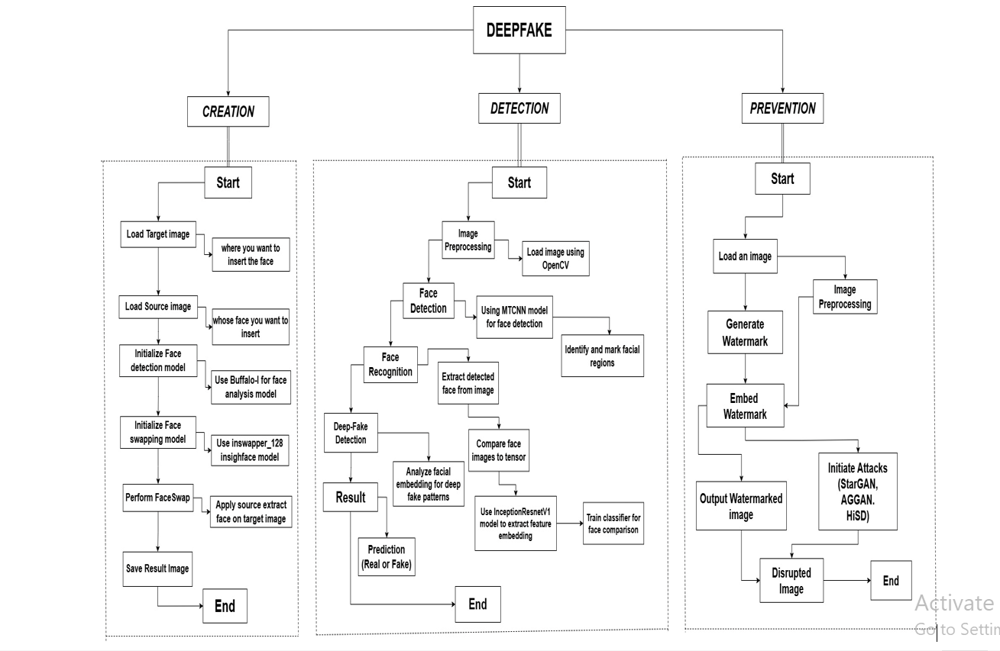
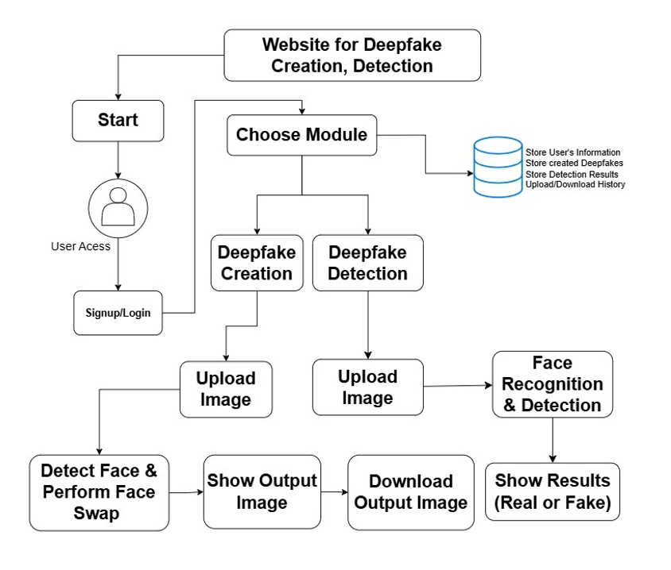

# Deepfake Generation, Detection, and Prevention using Deep Learning and Computer Vision

## Overview

This project presents an AI-powered web platform that integrates Deepfake Creation, Deepfake Detection, and research on Deepfake Prevention into a unified system.

The project was completed as my undergraduate Final Year Project (FYP) and combines machine learning, deep learning, computer vision, and web development to demonstrate practical AI implementation while exploring trustworthy AI techniques.

---

## Project Objectives

- Generate realistic face-swapped images
- Detect manipulated images using deep learning
- Explore prevention techniques against deepfake attacks
- Build an end-to-end AI web application

---

## Key Features

- 🔐 User authentication and account management
- 🎭 AI-powered deepfake face generation using InsightFace
- 🧠 Deepfake image detection using MTCNN and InceptionResNetV1
- 🛡️ Research on adversarial watermarking for deepfake prevention
- 🌐 Flask-based web application with image upload and download support
- 📊 Practical integration of deep learning models into a complete AI system

---

## Research Contributions

This project combines practical AI implementation with research into trustworthy AI. Rather than focusing solely on model development, it integrates multiple state-of-the-art deep learning techniques into a unified web platform while investigating approaches to improve the security of AI-generated media.

Key research contributions include:

- Integration of deepfake generation and detection into one platform.
- Comparative study of deepfake prevention approaches.
- Exploration of adversarial watermarking techniques.
- End-to-end deployment of AI models using Flask.

---

## Project Architecture

## AI Model Workflow

---

## Technologies

- Python
- Flask
- PyTorch
- OpenCV
- InsightFace
- MTCNN
- InceptionResNetV1
- SQLAlchemy
- SQLite
- HTML
- CSS
- JavaScript

---

## Future Work

Future improvements include:

- Video-based deepfake detection
- Real-time webcam detection
- Transformer-based vision models
- Explainable AI for detection decisions
- Robust adversarial watermarking
- Federated learning for privacy-preserving detection

---

## References

- InsightFace
- Buffalo_L
- MTCNN
- InceptionResNetV1 (FaceNet)
- PyTorch
- OpenCV
- Flask

---
## Repository Status

This repository showcases the project's architecture, methodology, and research contribution.

The source code is not publicly available because it was completed as part of an undergraduate research project.

Additional documentation, architecture diagrams, screenshots, and a demonstration video will be added soon.
